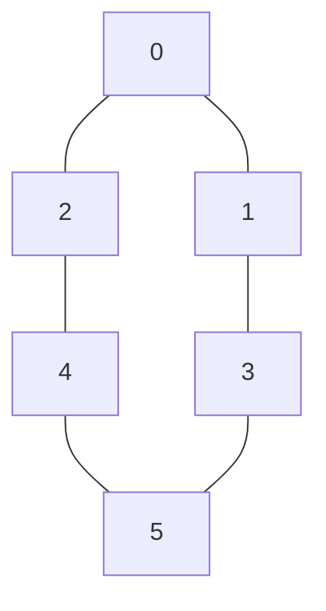

# Graphviz::DOT::Grammar

Raku package with a parser and interpreters of Graphviz DOT language.

Languages and formats DOT is translated to:

- [X] DONE DOT layout formats
  - SVG, EPS, JSON, plain, etc. 
- [X] DONE Mermaid-JS
- [-] TODO Mathematica
  - [X] DONE Basic vertexes and edges
  - [ ] TODO Vertex styles
  - [ ] TODO Edge styles
- [X] DONE PlantUML
  - PlantUML uses DOT language, so it was very short and easy format implementation.
- [ ] TODO Raku
  - Translation to Raku graphs, [AAp1]

------

## Usage examples

Here is a graph (see [AAp1]):

```perl6
use Graph::HexagonalGrid;

my $g = Graph::HexagonalGrid.new(1, 1);
```
```
# Graph(vertexes => 6, edges => 6, directed => False)
```

Translate to [Mermaid-JS]():

```perl6, output.prompt=NONE, output.language=mermaid
use Graphviz::DOT::Grammar;
$g.dot ==> dot-interpret(a=>'mermaid')
```


Translate to Mathematica:

```perl6, output.prompt=NONE,  output.language=mathematica
$g.dot ==> dot-interpret(a=>'Mathematica')
```
```mathematica
Graph[{}, {UndirectedEdge["4", "5"], UndirectedEdge["3", "5"], UndirectedEdge["2", "4"], UndirectedEdge["0", "2"], UndirectedEdge["1", "3"], UndirectedEdge["0", "1"]}]
```

------

## CLI

The package provides the Command Line Interface (CLI) script `from-dot`. Here its usage message:

```shell
from-dot --help
```
```
# Usage:
#   from-dot <text> [-t|--to=<Str>] [-o|--output=<Str>] -- Converts Graphviz DOT language texts or files into Mermaid-JS, Mathematica, Markdown, JSON, or SVG files.
#   
#     <text>               Input file or DOT spec.
#     -t|--to=<Str>        Format to convert to. (One of 'json', 'mathematica', 'mermaid', 'svg', or 'Whatever'.) [default: 'Whatever']
#     -o|--output=<Str>    Output file; if an empty string then the result is printed to stdout. [default: '']
```

------

## References 

[AAp1] Anton Antonov,
[Graph Raku package](https://github.com/antononcube/Raku-Graph),
(2024),
[GitHub/antononcube](https://github.com/antononcube).
